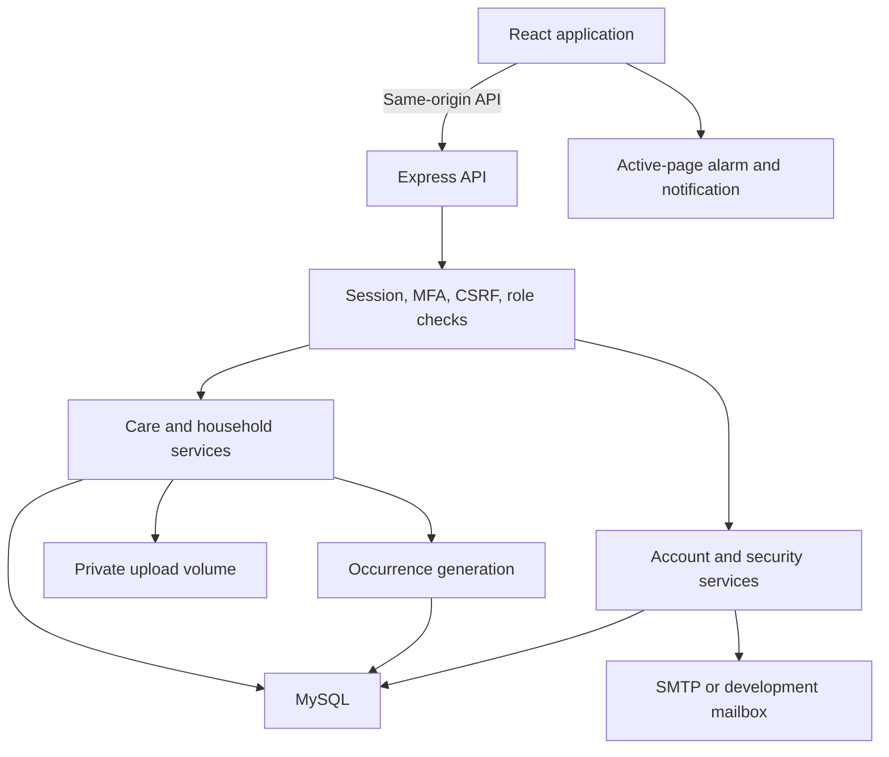
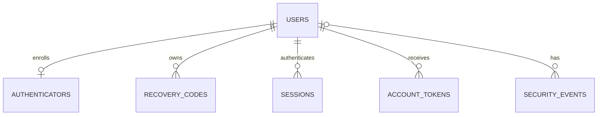
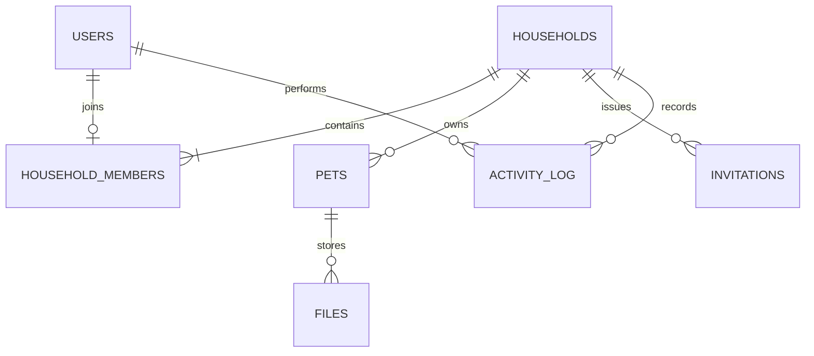
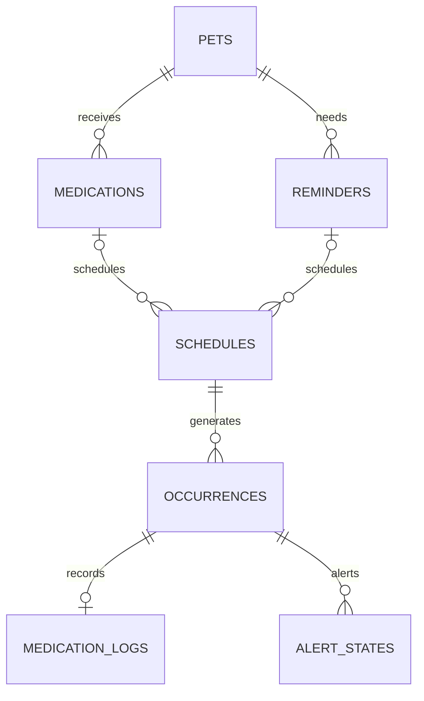
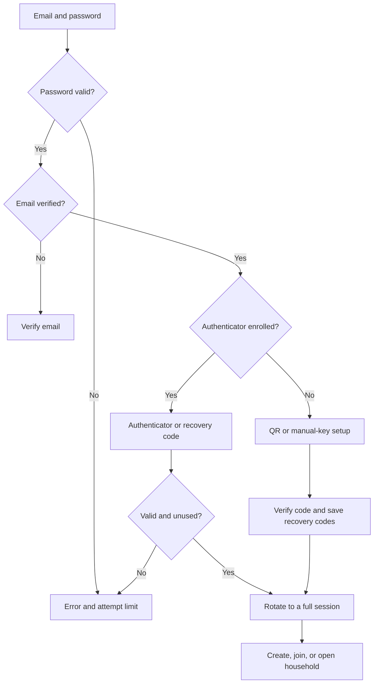

# PawCare — System design and database

**Version:** 1.0 implementation handoff  
**Date:** September 11, 2026  
**Source of truth for table definitions:** `database/schema.sql`  
**Implementation:** React/Vite, Express, MySQL, private filesystem uploads

The latest user request expanded the work from a planning milestone to a complete working system and database. The implemented release includes the original MVP plus feeding plans, grooming records, and expenses. It preserves the white/black visual design, user-uploaded pet photos, family coordination, and audible in-app care alarms.

## Architecture

Data and authentication state are stored on the server. The browser keeps only the alarm volume preference in local storage; it does not store password hashes, authenticator secrets after setup, persistent pet records, or login tokens there. A random session token is held in an HTTP-only cookie. Responses containing account or care data use `Cache-Control: no-store`.

The relational schema has **27 application tables**. The initialization script adds **one migration-tracking table**, `schema_migrations`, for 28 tables in an initialized database. There are no default users or sample treatment records.

## Complete table inventory and relationships

All IDs are `CHAR(36)` UUIDs unless stated otherwise. Timestamps are UTC `DATETIME(3)`. Date-only fields use `DATE`. Exact field lengths, nullability, checks, keys, and indexes are defined in the SQL file.

| Table | Primary key | Foreign keys / relationships | Purpose |
|---|---|---|---|
| `users` | `id` | Referenced by account, household, and author fields | Name, unique email, password hash, email verification |
| `authenticators` | `user_id` | `user_id → users.id` | Encrypted active/pending TOTP secret, enrollment time, last accepted time step |
| `recovery_codes` | `id` | `user_id → users.id` | Hashed, independently generated recovery codes and consumption timestamps |
| `sessions` | `token_hash` | Nullable `user_id → users.id` | Anonymous, enrollment, password-only, or fully authenticated sessions; CSRF token and expiry |
| `account_tokens` | `token_hash` | `user_id → users.id` | Expiring, single-use email verification and password-reset tokens |
| `rate_limits` | `bucket` | No FK; keyed digest of operation and account/IP scope | Persistent authentication attempt counters |
| `security_events` | `id` | Nullable `user_id → users.id` | Authentication/security event names and timestamps |
| `households` | `id` | Referenced by membership and care tables | Household name and IANA timezone |
| `household_members` | `user_id` | `user_id → users.id`; `household_id → households.id` | Exactly one active household per user; admin/member role |
| `invitations` | `id` | `household_id → households.id`; `created_by → users.id` | Email-bound hashed invitation, expiry, acceptance and revocation |
| `pets` | `id` | `household_id → households.id` | Pet identity, species, breed, age, markings, neutering, microchip, notes, archive state |
| `files` | `id` | Composite `(household_id, pet_id) → pets`; `uploaded_by → users.id` | Private photo/document metadata and storage key |
| `health_records` | `id` | Composite pet FK; `created_by → users.id` | Visits, symptoms, diagnosis, procedures, clinic and follow-up date |
| `vaccinations` | `id` | Composite pet FK; `created_by → users.id` | Vaccine, dose, administered date, next due date, batch and clinic |
| `appointments` | `id` | Composite pet FK; `created_by → users.id` | UTC appointment time, reason, clinic, veterinarian and status |
| `weight_logs` | `id` | Composite pet FK; `created_by → users.id` | Positive weight in kilograms and measurement date |
| `feeding_schedules` | `id` | Composite pet FK; `created_by → users.id` | Food, food type, portion text and dietary notes; reminders are scheduled separately |
| `grooming_records` | `id` | Composite pet FK; `created_by → users.id` | Activity, date, next due date, groomer and nonnegative cost |
| `expenses` | `id` | Composite pet FK; `created_by → users.id` | Nonnegative PHP amount, category, description, date and paid-by label |
| `medications` | `id` | Composite pet FK; `created_by → users.id` | User-entered medication, dose, route, instructions, date range and status |
| `reminders` | `id` | Composite pet FK; `created_by → users.id` | General care activity and instructions |
| `schedules` | `id` | Composite pet FK; composite FK to either medication or reminder | Recurrence, local clock time, timezone, UTC anchor, end and next generation time |
| `occurrences` | `id` | Composite schedule FK; `completed_by → users.id` | One scheduled dose/task; snapshot title/instructions and persisted outcome |
| `medication_logs` | `id` | Unique `occurrence_id → occurrences.id`; `user_id → users.id` | Exactly one Given/Skipped log per medication occurrence |
| `alert_states` | `(occurrence_id, user_id)` | `occurrence_id → occurrences.id`; `user_id → users.id` | Per-user snooze or dismissal of an occurrence’s alert |
| `record_files` | `id` | `file_id → files.id`; exactly one of health/vaccine/expense FKs | Document attachment links; API verifies matching household and pet |
| `activity_log` | `id` | `household_id → households.id`; `user_id → users.id` | Household actions, actor, entity reference and timestamp |

`schema_migrations` has `version`, `checksum`, and `applied_at`; it is maintained by the initialization script.

The principal ownership check for care data is the composite foreign key `(household_id, pet_id)`. A medication schedule additionally references `(household_id, pet_id, medication_id)`, and a reminder schedule references the corresponding reminder scope. This prevents a schedule from being attached to another household’s medication even if an ID is submitted incorrectly. Every API lookup also checks membership; database constraints complement that check.

## Scoped ERDs

### Accounts

Rate-limit buckets are deliberately separate from user foreign keys so nonexistent-email attempts can also be limited.

### Household ownership

### Care scheduling

Each schedule references exactly one medication or reminder, enforced by a CHECK constraint. Each occurrence is unique by `(schedule_id, due_at)`. The full table inventory above includes the remaining record/file relationships without compressing all 27 tables into one difficult-to-read diagram.

## Authentication and MFA

The second factor is a six-digit TOTP, with a 30-second period and a ±1-period validation window. The server records and atomically advances the last accepted time step to prevent replay. A maintained TOTP library is used rather than implementing the algorithm from scratch. The time-based mechanism is specified by [RFC 6238](https://datatracker.ietf.org/doc/html/rfc6238).

PawCare-specific choices:

- Passwords require 12–128 characters and are hashed with Argon2id. Parameters are 19 MiB memory, two iterations, and one lane. These baseline parameters follow [OWASP’s password-storage guidance](https://cheatsheetseries.owasp.org/cheatsheets/Password_Storage_Cheat_Sheet.html).
- TOTP secrets are encrypted with AES-256-GCM, a fresh nonce, and a server key held outside the database. They must be decryptable to verify generated codes, unlike password hashes.
- Each recovery set contains ten independent 128-bit random codes. Only keyed hashes are stored. Codes are normalized for spaces/hyphens and consumed once in an atomic update.
- Partial login lasts five minutes. Five failed verification attempts terminate that challenge. Account/IP throttles persist in MySQL and apply across new challenges; they use 15-minute buckets. Enrollment confirmation is also rate-limited.
- Full sessions last 12 hours. Session IDs are rotated after authentication and held in HTTP-only, SameSite=Strict cookies; production cookies are Secure. Mutating requests require a matching CSRF token and, when present, the configured Origin.
- Factor replacement requires the password and a current TOTP or unused recovery code. The old factor remains valid until the pending new factor is confirmed. Replacement invalidates all old recovery codes and sessions, then issues a fresh session to the successful caller.
- Password reset updates the password, consumes reset tokens, revokes sessions, and returns the user to normal login; it does not clear the authenticator. This recovery flow is informed by [OWASP’s password-reset guidance](https://cheatsheetseries.owasp.org/cheatsheets/Forgot_Password_Cheat_Sheet.html).
- The application has no MFA-off toggle or admin override for another person’s account. Recovery codes must be saved before access is lost. TOTP is not phishing-resistant; passkeys are a possible later enhancement. See [OWASP MFA guidance](https://cheatsheetseries.owasp.org/cheatsheets/Multifactor_Authentication_Cheat_Sheet.html).

## Permissions

| Action | Household admin | Family member |
|---|---|---|
| Read own household records and private files | Yes | Yes |
| Add/edit/archive pets; replace or remove pet photos | Yes | No |
| Create/edit/stop medication and reminder schedules | Yes | No |
| Complete, skip with reason, snooze, or dismiss due care | Yes | Yes |
| Add health, vaccination, appointment, weight, feeding, grooming, expense records | Yes | Yes |
| Edit those records | Any household record | Own authored records |
| Archive records/documents | Yes | No |
| Upload documents and link same-pet attachments | Yes | Yes |
| Invite, remove, or change roles | Yes | No |
| Change another person’s password or factor | No | No |

The last active admin cannot be removed or demoted. Membership changes lock the household row before counting admins. Care routes derive the actor and household from the session; submitted `created_by`, `completed_by`, and household IDs are never used as authority.

## Medication and alarm behavior

The prescription record describes the user’s instructions. A schedule describes repetition. An occurrence is one expected care task. A medication log records a person’s actual Given or Skipped action. The UI’s Due/Overdue/Upcoming labels are timing information, not medical judgments.

Creating a schedule generates future occurrences through a seven-day horizon. A repeated request cannot duplicate an occurrence because `(schedule_id, due_at)` is unique. The server stores the schedule’s timezone and a UTC anchor. Daily/weekly/monthly schedules follow local wall-clock time; fixed-hour schedules advance by elapsed time. A day-31 monthly schedule uses February’s last day and returns to day 31 in March. Starting a new schedule does not invent past administered or missed doses.

The browser polls shared care data every 15 seconds and checks due times every second while active. A per-tab set prevents repeatedly opening the same alert. Snooze/dismiss state is persisted per user so one caregiver’s decision to silence an alert does not silence another caregiver’s reminder. Cross-tab sound coordination is not implemented; use one active PawCare tab per device when alarm sound is enabled.

Completion locks the occurrence and checks its current state. The first valid request records the actor/time and creates the medication log; a second concurrent request receives a conflict. Snooze changes only the current user’s next alert time. Dismiss leaves the task pending. Skip requires a reason. Editing/stopping schedules cancels only future pending occurrences; prior logs and unresolved past tasks remain available.

The original requirement for browser audio is met by a looped local WAV played through `HTMLAudioElement`. The user explicitly enables/tests playback. Notifications need a separate browser permission. Closed-app push delivery remains outside this release.

## Screens and visual rules

The desktop layout uses a narrow sidebar, a small household/account bar, and a working dashboard. The first screen after login shows today’s care, completion counts, upcoming tasks, pet cards, recent health notes, vaccination due dates, and family activity. Forms open in keyboard-accessible native dialogs. A mobile menu replaces the fixed sidebar on narrow viewports.

The palette is white, black, and neutral gray. Primary buttons are black/white; cards use thin gray borders and restrained corners. Errors use a small red text/border accent. No pet age, diagnosis, medication, or photo is fabricated as the user’s real data. Empty states guide the user to create actual records. The default pet placeholder uses a paw icon until a photo is uploaded.

## API map

All paths below are under `/api`. Private endpoints require a full MFA session and, where applicable, active household membership. Methods and validation are implemented in the corresponding router.

| Area | Routes |
|---|---|
| Session | `GET /auth/status`, `POST /auth/login`, `POST /auth/logout` |
| Registration/email | `POST /auth/register`, `/auth/verify`, `/auth/resend-verification` |
| Password recovery | `POST /auth/forgot`, `/auth/reset` |
| MFA | `POST /auth/mfa/setup`, `/auth/mfa/confirm`, `/auth/mfa/verify` |
| Security settings | `GET /auth/security`; `POST /auth/recovery/regenerate`, `/auth/mfa/replace/start`, `/auth/mfa/replace/confirm` |
| Household | `POST /household`, `POST /household/join` |
| Family | `GET /family`; `POST /family/invite`; `PATCH /family/:userId`; `DELETE /family/invitations/:id` |
| Pets | `GET/POST /pets`; `PATCH/DELETE /pets/:id` |
| Typed records | `GET/POST /records/:kind`; `PATCH/DELETE /records/:kind/:id` |
| Medication/reminders | `GET/POST /medications` or `/reminders`; `PATCH/DELETE /medications/:id` or `/reminders/:id` |
| Shared care | `GET /care`; `POST /care/:id/action`; `GET /history`; `GET /activity` |
| Documents/photos | `GET/POST /files`; `GET /files/:id/content`; `DELETE /files/:id`; `POST /files/:id/link`; `GET /files/links/:kind/:id` |

`kind` for typed records is restricted to `health`, `vaccinations`, `appointments`, `weight`, `feeding`, `grooming`, or `expenses`; it cannot select an arbitrary SQL table. List endpoints for records, medications, reminders, files, and medication history accept a validated numeric `offset` and return at most 500 rows per request.

Create responses return `{ "id": "uuid" }`; action/update responses return `{ "ok": true }`. Errors use `{ "error": "readable message" }` with status 400/401/403/404/409/429 as appropriate. Server errors return a generic message without SQL or credentials. Uploads use multipart form data; all other mutations use JSON and an `X-CSRF-Token` header.
